# Experiments

## 1. Introduction

These experiments, as well as serving as a demonstration of the pipeline, are
intended to explore how the architecture designs for Convolutional Neural 
Networks have evolved throughout the years and how it affects the performance for
a small-sized classification task. Through a small selection of different
architectures we compare the evolution of performance across them and explain 
the causes of the differences in the performance.

The architectures that will be studied are:

- VGG16 (2014): demonstrated that depth using small 3×3 convolutions consistently
outperforms shallower networks with larger filters.
- ResNet50 (2015): introduced residual connections, solving the vanishing gradient
problem and enabling much deeper networks.
- EfficientNet-B0 (2019): proposed compound scaling to balance depth, width, 
and resolution simultaneously.
- ConvNeXt-Tiny (2022): modernized the classic ConvNet design by incorporating 
ideas from Vision Transformers.

We will also study how finetuning affect performance and on which architectures
this is more noticeable. Finally, there is one experiment showing the effect 
that dataset augmentation has on the model performance.

The dataset used is the [Architecture Dataset](https://www.kaggle.com/datasets/wwymak/architecture-dataset)
from Kaggle: 25 architectural style classes with approximately 4,800 images in
total. It is imbalanced, i.e., some classes have significantly fewer examples than 
others.

**Fixed setup across all experiments:**

| Field | Value |
|---|---|
| Optimizer | AdamW |
| LR | 0.0001 |
| Weight decay | 0.001 |
| Scheduler | Cosine (T_max=50) |
| Augmentation | No (except exp009) |
| Batch size | 32 |
| Max epochs | 50 |
| Early stopping patience | 10 |

The optimizer AdamW with the scheduler CosineAnnealing was chosen as it is usually 
the most reliable default across all architectures. Every hiperparameter was 
fixed for all experiments to isolate the effect of them on the performance.

The experiments were seeded in order to be able to reproduce them with as much
fidelity as possible.

---

## 2. Scratch Training

In this section all four models were trained from scratch. That means that the
weights started from a random position, so the model had no prior knowledge that
could help with the classification task. This makes the task more difficult for
the models wich is worsened by the small size of the dataset they are trained on.

### Results

| Model | Params | Train Loss | Val Loss | Test Loss | Test Acc | Macro Precision | Macro Recall | Macro F1 | Training time/epoch |
|---|---|---|---|---|---|---|---|---|---|
| VGG16 | ~138M | 0.0313 | 4.0714 | 2.0321 | 0.4063 | 0.3792 | 0.3546 | 0.3453 | ~49s |
| ResNet50 | ~25M | 0.2668 | 2.4562 | 2.4245 | 0.2908 | 0.2530 | 0.2487 | 0.2290 | ~25s |
| EfficientNet-B0 | ~5.3M | 0.5219 | 2.9414 | 2.4249 | 0.3326 | 0.2577 | 0.2565 | 0.2407 | ~15s |
| ConvNeXt-Tiny | ~28.5M | 0.1637 | 3.6523 | 2.6564 | 0.2171 | 0.1486 | 0.1641 | 0.1454 | ~44s |

### Key findings

The difference between the train loss and val loss and the graphs themselves 
reveal that all models overfit significantly. The most notable is VGG16, whith a
train loss of 0.0313 over a val loss of 4.0714 at the last epoch. This is due to
the small size of the dataset: these models were designed for bigger datasets, 
such as ImageNet, where they had to recognise a wide variety of images (one of a
cat, of a human, of a building or of a car, for example). They have, therefore 
millions of parameters in order to be able to extract different patterns for many
things. When training these models with our small dataset, and after seing the 
same images over and over again for each epoch, they start to memorize the images
rather than extracting the features that make them able to classify the images.

<table>
  <tr>
    <td align="center">
      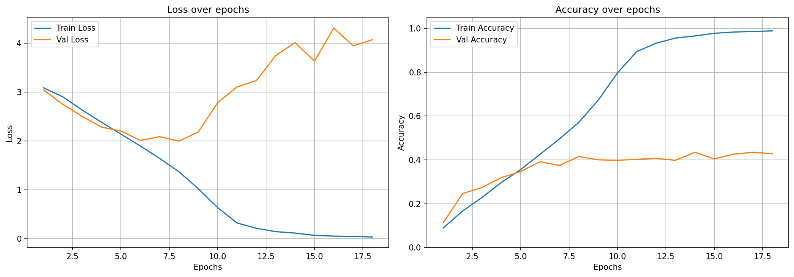
       VGG16 training curves
    </td>
    <td align="center">
      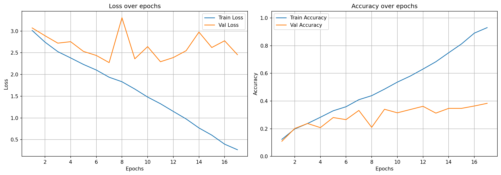
       ResNet training curves
    </td>
  </tr>
  <tr>
    <td align="center">
      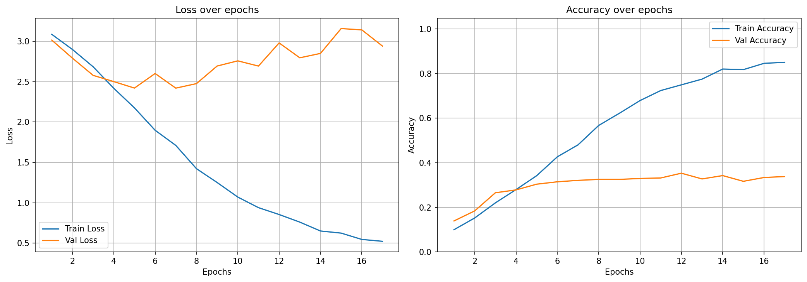
       EfficientNet-B0 training curves
    </td>
    <td align="center">
      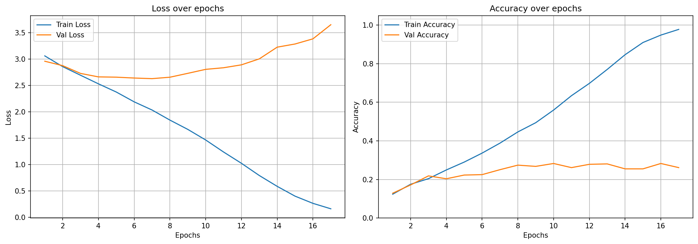
       ConvNeXt-Tiny training curves
    </td>
  </tr>
</table>

As it can be seen in the graphs, VGG16's val loss started growing after a few
epochs while train loss kept decreasing, this happened with EfficientNet and 
ConvNeXt too. However, ResNet had a different behaviour, after a few epochs the
val loss started oscillating showing a noisier graph. The reason for this 
phenomenon is likely related to the architecture design, though the exact cause
is uncertain.

It is interesting to see that the latest model, ConvNeXt, is the one with the 
worst performance, while the one with the best performance is the first one, VGG16.
First, let's clarify that for small classification tasks like this one, usually 
smaller models are better, as they don't need as many parameters or depth to
be able to extract a small amount of features in order to classify the images
correctly. However, VGG16 is the model with more parameters but it is still the
best one in terms of accuracy. The reason for this is that as new architectures
were developed, they added more complexity on the design that made the optimization
landscape harder to find good local optima. So, when training a VGG16 model, it
is able to find a better local optimum faster than other architectures. Even though
on other architectures the global minimum can be much better than in VGG16, they
can get stuck on worse local minima that makes the performance worse. ConvNeXt,
for example, was designed around training recipes with strong augmentation and
longer schedules in order to overcome that.

One more thing to mention is that, even though VGG16 is the best of all four, 
EfficientNet outperforms ResNet and ConvNeXt, while also being the one with fewer
parameters (~5.3M) and just having a training duration of ~15 seconds per epoch.

---

## 3. Finetuned Training

In this section all four models are finetuned for the classification task using
weights pretrained on the ImageNet dataset. This allows the model to start in a
better position, with better scores across all metrics. The models with these
weights have already learned important features for image classification, even
if it is not the exact same task, so the models start near good optima and within
a few epoch it is finetuned for this specific task.

### Results

| Model | Params | Train Loss | Val Loss | Test Loss | Test Acc | Macro Precision | Macro Recall | Macro F1 | Training time/epoch |
|---|---|---|---|---|---|---|---|---|---|
| VGG16 | ~138M | 0.0179 | 1.7735 | 1.0562 | 0.7091 | 0.6969 | 0.6651 | 0.6673 | ~49s |
| ResNet50 | ~25M | 0.0387 | 1.1529 | 0.8567 | 0.7749 | 0.7527 | 0.7377 | 0.7348 | ~25s |
| EfficientNet-B0 | ~5.3M | 0.0403 | 0.7803 | 0.8001 | 0.7828 | 0.7572 | 0.7475 | 0.7467 | ~15s |
| ConvNeXt-Tiny | ~28.5M | 0.0299 | 0.8740 | 0.6479 | 0.8127 | 0.8021 | 0.7752 | 0.7808 | ~44s |

### Key findings

We can see how pretraining has dramatically improved all the models, using test
accuracy as a reference the difference varies from ~0.30 to ~0.60 depending on 
the architecture. This also changes the ranking as ConvNeXt-Tiny goes from 
0.2171 in the from-scratch setup to 0.8127, becoming the best model in  terms of
accuracy. It is then followed by EfficientNet, ResNet50 and finally VGG16, which
was previously the best performer model. ConvNeXt also achieves the minimum val
loss, which can be seen in the graphs below, across al finetuned runs, supporting
the claim that its modern architecture extracts more expressive representations.

<table>
  <tr>
    <td align="center">
      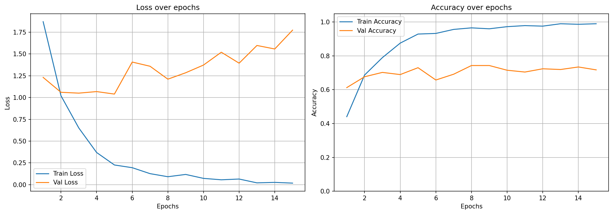
       VGG16 training curves
    </td>
    <td align="center">
      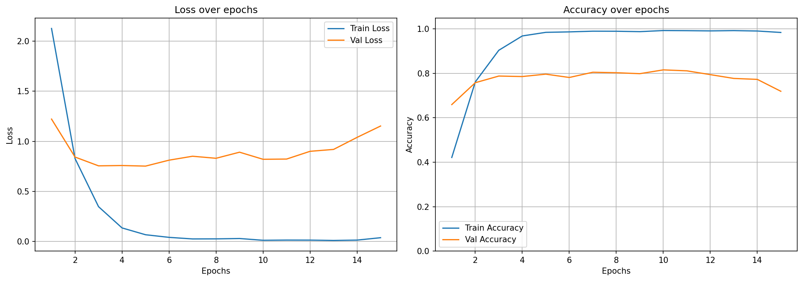
       ResNet training curves
    </td>
  </tr>
  <tr>
    <td align="center">
      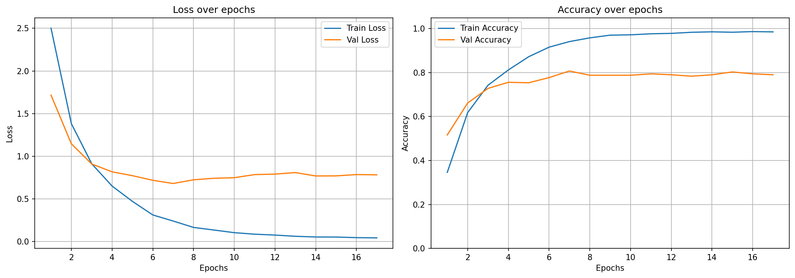
       EfficientNet-B0 training curves
    </td>
    <td align="center">
      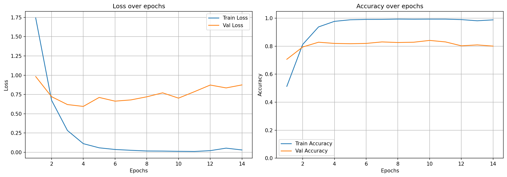
       ConvNeXt-Tiny training curves
    </td>
  </tr>
</table>

On the graph we still can see that the models overfit, as train loss reaches near
0 while val loss rises or stagnates after an initial improvemente. We can see
that most of the performance comes from the pretrained weights, as the initial
and final val accuracy scores differ from ~0.10 to ~0.30, which are still 
relevant on their own, as this means that the models are learning task-specific
features in early epochs.

Finally, we can see that EfficientNet achieves similar results to ConvNeXt, 
0.7828 compared to 0.8127, but taking a fraction of the time (~15s vs ~44s per
epoch). So, while ConvNeXt achieves better scores by a margin, if time and 
computation resources constrains are important, EfficientNet can be a better
alternative. 

---

## 4. Scratch vs Finetuned

After analysing both scratch and finetuned runs across all models, we see some
common patterns appearing.

### Zero-Score Classes

In all models we see that after training from scratch there are some classes, 
especially the ones that are underrepresented, that get zero-score in per-class
metrics. American Foursquare, Bauhaus and Palladian architecture are some of these
classes. However, in the finetuned runs we see all these zero-score classes
disappear, as the model start to guess correctly the labels for the underrepresented
classes. So they do not only have more accuracy overall but also on harder classes.

<table>
  <tr>
    <td align="center">
      
From Scratch

      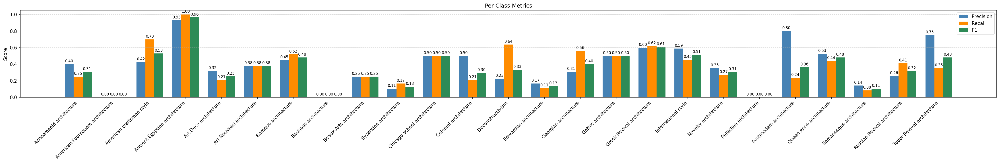
       
    </td>
    <td align="center">
      
Finetuned

      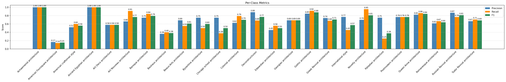
       
    </td>
  </tr>
  <tr>
    <td align="center">
      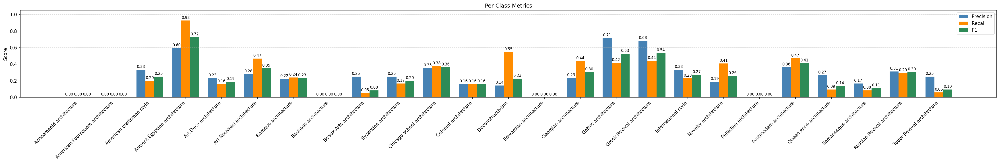
       
    </td>
    <td align="center">
      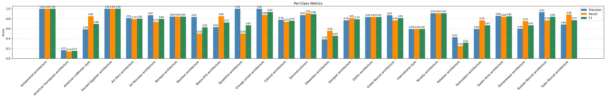
       
    </td>
  </tr>
  <tr>
    <td align="center">
      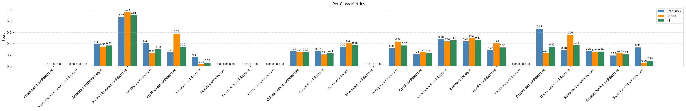
       
    </td>
    <td align="center">
      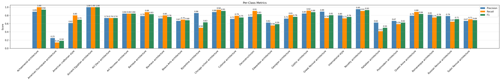
       
    </td>
  </tr>
  <tr>
    <td align="center">
      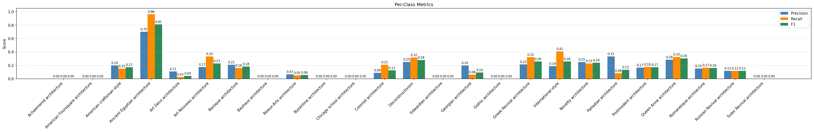
       
    </td>
    <td align="center">
      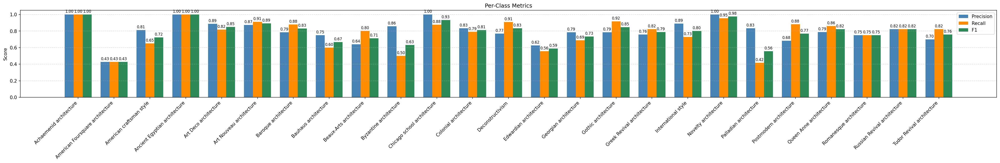
       
    </td>
  </tr>
</table>

### Garbage Collector Classes

Another thing worth noting is that garbage collector classes also disappear in the
finetuned versions. These are classes that the model uses as an answer when it
is not sure where the image belongs to, any image can be labeled as this. For
example, in the confusion matrix for the EfficientNet run is clear that
Art-Noveau and Queen Anne architecture are these kind of classes. However, 
pretrained models start with stable, discriminative feature representations for 
all classes, so they have enough signal to make a meaningful prediction for
each class from early in training and thus do not tend to rely on garbage 
collectors.

<table>
  <td align="center">
    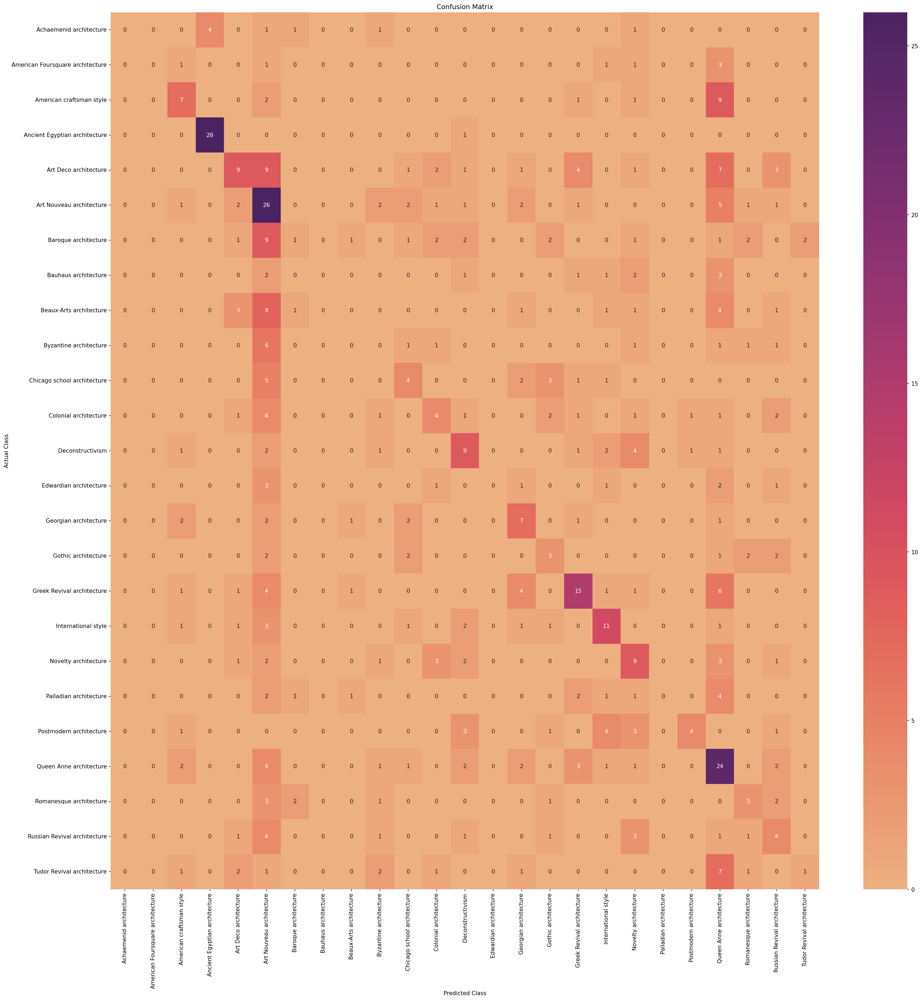
     From-Scratch
  </td>
  <td align="center">
    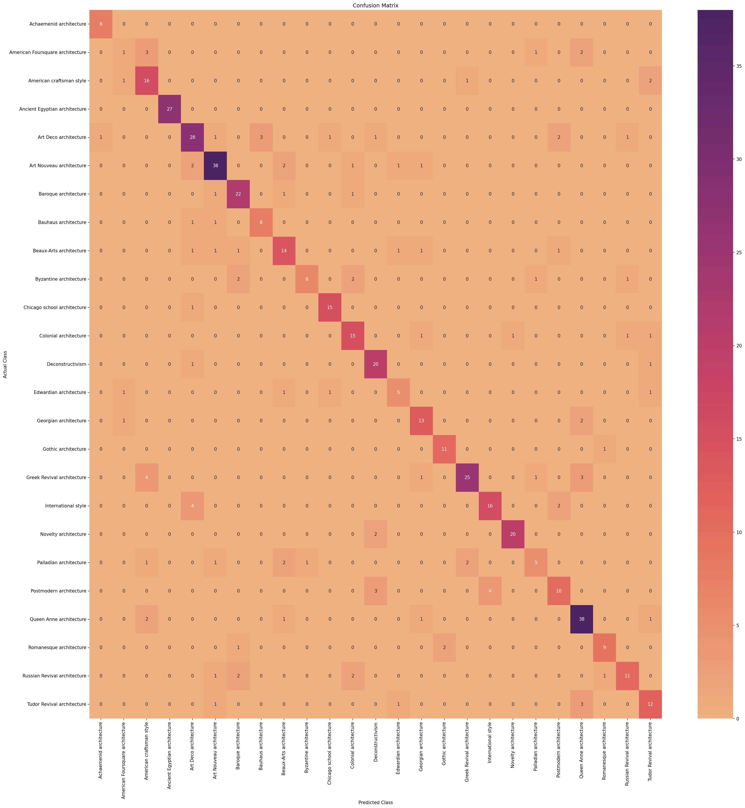
     Finetuned
  </td>
</table>

### Accuracy gain from pretraining

| Model | Scratch Test Acc | Finetuned Test Acc | Gain |
|---|---|---|---|
| VGG16 | 0.4063 | 0.7091 | +0.3028 |
| ResNet50 | 0.2908 | 0.7749 | +0.4841 |
| EfficientNet-B0 | 0.3326 | 0.7828 | +0.4502 |
| ConvNeXt-Tiny | 0.2171 | 0.8127 | +0.5956 |

After describing the things that all models have in common we can focus on the
differences. The most notable is the difference of gain between models. VGG16 
gains 0.3028 in test accuracy in the pretrained run, while ConvNeXt-Tiny gains
0.5956, which is almost the double compared to the VGG16. This highlights how
new architectures, such as ConvNeXt, are designed around large datasets, high
augmentation and long training time. Another thing to take into account when
talking about this difference is that VGG16 was able to extract useful features 
in the from-scratch run given its simple optimization landscape.

---

## 5. Augmentation

After studying the difference between these models, now we are choosing the
best performing model, ConvNeXt, to see if augmentation does meaningfully reduce
overfitting and improve generalisation.

### Results

| Exp | Augmentation | Train Loss | Val Loss | Test Loss | Test Acc | Macro F1 |
|---|---|---|---|---|---|---|
| Exp008 | No | 0.0299 | 0.8740 | 0.6479 | 0.8127 | 0.7808 |
| Exp009 | Yes | 0.1908 | 0.5711 | 0.6175 | 0.8266 | 0.7978 |

### Key findings

The results show that augmentation did indeed reduce the overfitting problem, as
train loss did not reach near 0 (0.19 vs 0.03 without augmentation), and the gap
between train and val metrics also narrowed down significantly.

<table>
  <td align="center">
    
     Without Augmentation
  </td>
  <td align="center">
    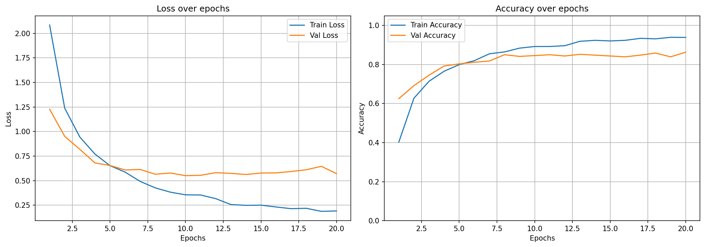
     With Augmentation
  </td>
</table>

Test accuracy improved from 0.8127 to 0.8266, a modest gain. Also, the model ran
for 20 epochs instead of 14 without augmentation, that suggests that augmentation
slowed down convergence but led to a better final checkpoint. However, augmentation
alone is not sufficient to solve the overfitting problem on this dataset, as the
val and train loss decouple after some epochs and still presents some divergence.
The model still memorises the data, just more slowly, so more data would likely
be needed for a substantial improvement.

---

## 6. Overall Conclusions

*This section should be written last, after all other sections are complete.
Synthesise the findings into a coherent narrative.*

### Architecture evolution

*Discuss how the four architectures reflect the evolution of CNN design from
2014 to 2022, and what your results tell you about that evolution:*

- *VGG16 (2014): simple, deep, but effective from scratch on small data due to
  its straightforward optimization landscape. Poor efficiency.*
- *ResNet50 (2015): residual connections help on large datasets but add
  instability from scratch on small data. Good efficiency/accuracy tradeoff
  when finetuned.*
- *EfficientNet-B0 (2019): compound scaling gives the best efficiency/accuracy
  ratio. Comparable to ResNet finetuned at a fraction of the compute.*
- *ConvNeXt-Tiny (2022): best absolute performance when finetuned, worst from
  scratch. Demonstrates that modern architectures are increasingly designed
  around the assumption of pretraining and large-scale data.*

### Practical recommendations

*Given a small dataset classification task like this one, what would you
recommend based on your results:*

- *If compute is constrained: EfficientNet-B0 finetuned.*
- *If accuracy is the priority: ConvNeXt-Tiny finetuned.*
- Both finutuned.
- *Avoid training from scratch on datasets of this size regardless of
  architecture.*

### Limitations

  statistically enough
- *Single run per experiment — results are not be statistically robust.*
- *Optimizer and scheduler effect was not isolated — AdamW with cosine was
  fixed across all runs as a pragmatic choice.*
- *Augmentation was only tested on the best model — it may have different
  effects on other architectures.*
- *Class imbalance was not addressed — some classes had significantly fewer
  examples and consistently underperformed.*

Architecture evolution narrative
The central finding is that architectural progress doesn't translate linearly to better performance in all settings. Newer architectures are better when finetuned but worse from scratch on small data. That's the story. Specifically:

VGG16's simplicity is an advantage from scratch, not a limitation. Its sequential design and large FC layers make it easier to optimize on small data.
ResNet50 adds residual connections which help on large datasets but introduce instability from scratch here, though finetuned it improves over VGG16.
EfficientNet-B0 is the efficiency story — comparable accuracy to larger models at a fraction of the compute. That's its design goal and your results confirm it.
ConvNeXt-Tiny demonstrates that modern architectures increasingly assume pretraining as a prerequisite. Best finetuned, worst from scratch. The gap between its scratch and finetuned performance (+0.5956) is the largest of any model and makes this point concretely.

Practical recommendations
Keep these grounded in your actual numbers, not general ML advice:

Small dataset, compute constrained: EfficientNet-B0 finetuned. 0.7828 accuracy at ~15s/epoch.
Small dataset, accuracy priority: ConvNeXt-Tiny finetuned with augmentation. 0.8266 accuracy.
Scratch training on datasets this size: not recommended regardless of architecture. Best scratch result was VGG16 at 0.4063 — well below any finetuned model.

What augmentation told you
It helps but modestly. The gain was ~0.014 in test accuracy. The more meaningful finding is that it slowed memorization rather than solving the underlying data scarcity problem.
Limitations — be honest about these

Single run per experiment. You cannot make statistical claims about which differences are meaningful vs noise.
Optimizer effect was not tested. AdamW with cosine was a pragmatic choice, not a proven optimum.
Augmentation was only tested on ConvNeXt finetuned. Its effect on other architectures or scratch training is unknown.
Class imbalance was not addressed. Underrepresented classes consistently underperformed across all runs.
The dataset itself has inherently ambiguous class pairs (Art Deco/Art Nouveau, American Craftsman/Foursquare) that no model fully resolved, which sets a practical ceiling on accuracy independent of architecture.